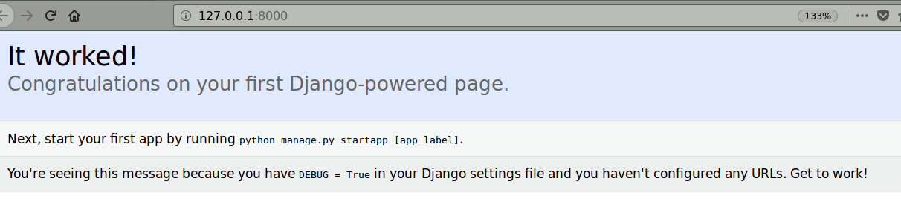
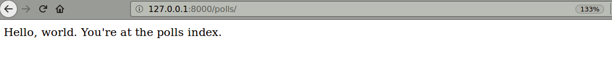
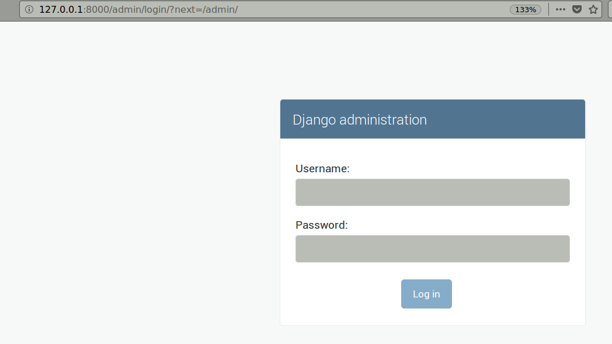
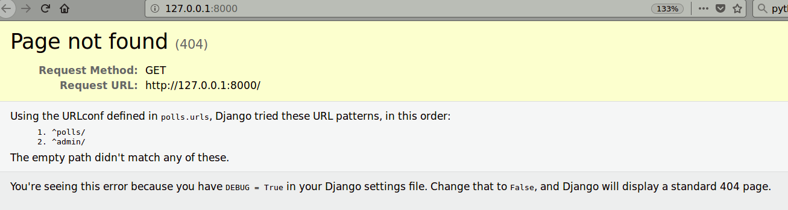
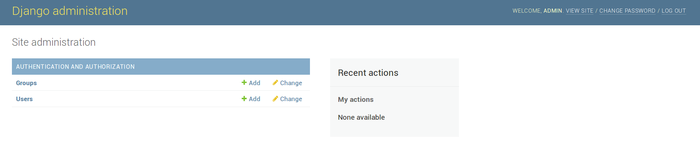
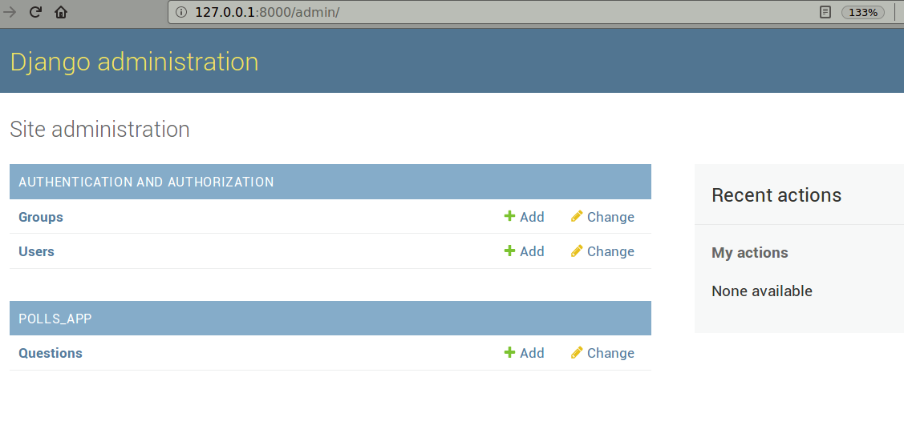
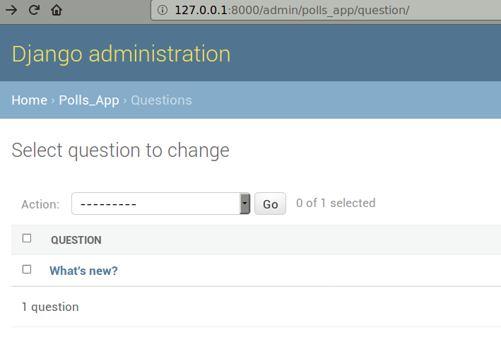

# Writing Django

Having only used the `flask` framework, I thought it might be fun to check out Python's [Django](https://www.djangoproject.com/) framework.

As far as I can tell, it is a heavy-weight framework very much like PHP's [Laravel](https://laravel.com/).

__tl;dr__ As with `npm` versus `pip` (where the similiarities seem to far outnumber any differences),
there are naming differences between `Django` and `Laravel` but the overall workflow and structure
seems - perhaps not all that surprisingly - almost exactly the same.

## Pre-requisites

Python is required, also a package manager (either `pip` or `pip3`) appropriate to the Python version.

Verify the installed version of Python as follows:

    $ python --version

[Python 2.7.12 in my case. Don't worry about version issues, Django will create needed `__future__` import statements auto-magically.]

Install the latest version of Django (plus dependencies) as follows:

    $ pip install --user django

[Replace `pip` with `pip3` as appropriate.]

[The dependency Python Time Zone module `pytz` will also be installed.]

Verify the installed version of Django as follows:

    $ python -m django --version

[Version 1.11.10 in my case.]

## Create a Project

Use the `django-admin` command to do this:

    $ django-admin startproject polls

Note that [django-admin](https://docs.djangoproject.com/en/1.11/ref/django-admin/)
 creates a folder plus infra-structure files, much like `maven` or `sbd`.

Lets check the development server works:

    $ cd polls
    $ python manage.py runserver

The results should be something like:

    Performing system checks...
    
    System check identified no issues (0 silenced).
    
    You have 13 unapplied migration(s). Your project may not work properly until you apply the migrations for app(s): admin, auth, contenttypes, sessions.
    Run 'python manage.py migrate' to apply them.
    
    February 11, 2018 - 21:43:01
    Django version 1.11.10, using settings 'polls.settings'
    Starting development server at http://127.0.0.1:8000/
    Quit the server with CONTROL-C.
    ^C$

The development server at http://127.0.0.1:8000/ should look something like:

## Projects versus Apps

A project is mostly concerned with a website, whereas an app is mostly concerned with an application (or `microservice` if you will).

An app can live anywhere, but for the sake of convenience we will create this one in our current project.

## Create an App

This needs to be done in the folder where `manage.py` lives:

    $ python manage.py startapp polls-app

And if, like me, you are from a polyglot background, you will now get a reminder
that Python prefers underscores to hyphens:

    CommandError: 'polls-app' is not a valid app name. Please use only numbers, letters and underscores.
    $

So lets get with the program:

    $ python manage.py startapp polls_app

This will create a `polls_app` folder, plus files.

## Create a View

Open `polls_app/views.py` and change it as follows:

    $ diff -uw views.py.orig views.py
    --- views.py.orig	2018-02-11 14:18:23.894106000 -0800
    +++ views.py	2018-02-11 14:25:03.776911375 -0800
    @@ -3,4 +3,7 @@
     
     from django.shortcuts import render
     
    -# Create your views here.
    +from django.http import HttpResponse
    +
    +def index(request):
    +    return HttpResponse("Hello, world. You're at the polls index.")
    $

Create a `polls_app/urls.py` file and change it as follows:

    # -*- coding: utf-8 -*-
    from __future__ import unicode_literals
    
    from django.conf.urls import url
    
    from . import views
    
    urlpatterns = [
        url(r'^$', views.index, name='index'),
    ]

Next update the `polls/urls.py` file as follows:

    $ diff -uw urls.py.orig urls.py
    --- urls.py.orig	2018-02-11 14:37:19.727374508 -0800
    +++ urls.py	2018-02-11 14:45:15.909210776 -0800
    @@ -13,9 +13,11 @@
         1. Import the include() function: from django.conf.urls import url, include
         2. Add a URL to urlpatterns:  url(r'^blog/', include('blog.urls'))
     """
    +from django.conf.urls import include
     from django.conf.urls import url
     from django.contrib import admin
     
     urlpatterns = [
    +    url(r'^polls/', include('polls_app.urls')),
         url(r'^admin/', admin.site.urls),
     ]
    $

Again, lets check to see if everything works:

    $ python manage.py runserver

The polls app at http://127.0.0.1:8000/polls/ should look as follows:

The admin interface at http://127.0.0.1:8000/admin/ should look as follows:

And our development server at http://127.0.0.1:8000/ should now look like:

[END OF PART 1]

[START OF PART 2]

## Database setup

We _could_ open `polls/settings.py` and change the database settings but as 
I prefer to leave the time zone set to UTC this will not be needed. We will
also stick with the default `sqlite3` database.

So lets run our [database migrations](https://docs.djangoproject.com/en/1.11/topics/migrations/):

    $ python manage.py migrate

The results should look as follows:

    Operations to perform:
      Apply all migrations: admin, auth, contenttypes, sessions
    Running migrations:
      Applying contenttypes.0001_initial... OK
      Applying auth.0001_initial... OK
      Applying admin.0001_initial... OK
      Applying admin.0002_logentry_remove_auto_add... OK
      Applying contenttypes.0002_remove_content_type_name... OK
      Applying auth.0002_alter_permission_name_max_length... OK
      Applying auth.0003_alter_user_email_max_length... OK
      Applying auth.0004_alter_user_username_opts... OK
      Applying auth.0005_alter_user_last_login_null... OK
      Applying auth.0006_require_contenttypes_0002... OK
      Applying auth.0007_alter_validators_add_error_messages... OK
      Applying auth.0008_alter_user_username_max_length... OK
      Applying sessions.0001_initial... OK
    $

## Model Creation

Now lets create our models - update `polls_app/models.py` as follows:

    $ git diff polls_app/models.py
    diff --git a/polls/polls_app/models.py b/polls/polls_app/models.py
    index 1dfab76..04bb7f0 100644
    --- a/polls/polls_app/models.py
    +++ b/polls/polls_app/models.py
    @@ -3,4 +3,13 @@ from __future__ import unicode_literals
     
     from django.db import models
     
    -# Create your models here.
    +
    +class Question(models.Model):
    +    question_text = models.CharField(max_length=200)
    +    pub_date = models.DateTimeField('date published')
    +
    +
    +class Choice(models.Model):
    +    question = models.ForeignKey(Question, on_delete=models.CASCADE)
    +    choice_text = models.CharField(max_length=200)
    +    votes = models.IntegerField(default=0)
    $

## Model Activation

Now lets activate our models - update `polls/settings.py` as follows:

    $ git diff polls/settings.py
    diff --git a/polls/polls/settings.py b/polls/polls/settings.py
    index 787a666..5892350 100644
    --- a/polls/polls/settings.py
    +++ b/polls/polls/settings.py
    @@ -31,6 +31,7 @@ ALLOWED_HOSTS = []
     # Application definition
     
     INSTALLED_APPS = [
    +    'polls_app.apps.PollsAppConfig',
         'django.contrib.admin',
         'django.contrib.auth',
         'django.contrib.contenttypes',
    $

And lets create our migrations:

    $ python manage.py makemigrations polls_app

The results should look like:

    Migrations for 'polls_app':
      polls_app/migrations/0001_initial.py
        - Create model Choice
        - Create model Question
        - Add field question to choice
    $

Lets verify what the resulting SQL looks like:

    $ python manage.py sqlmigrate polls_app 0001

It should look like (bear in mind this is SQLite):

    BEGIN;
    --
    -- Create model Choice
    --
    CREATE TABLE "polls_app_choice" ("id" integer NOT NULL PRIMARY KEY AUTOINCREMENT, "choice_text" varchar(200) NOT NULL, "votes" integer NOT NULL);
    --
    -- Create model Question
    --
    CREATE TABLE "polls_app_question" ("id" integer NOT NULL PRIMARY KEY AUTOINCREMENT, "question_text" varchar(200) NOT NULL, "pub_date" datetime NOT NULL);
    --
    -- Add field question to choice
    --
    ALTER TABLE "polls_app_choice" RENAME TO "polls_app_choice__old";
    CREATE TABLE "polls_app_choice" ("id" integer NOT NULL PRIMARY KEY AUTOINCREMENT, "choice_text" varchar(200) NOT NULL, "votes" integer NOT NULL, "question_id" integer NOT NULL REFERENCES "polls_app_question" ("id"));
    INSERT INTO "polls_app_choice" ("choice_text", "votes", "id", "question_id") SELECT "choice_text", "votes", "id", NULL FROM "polls_app_choice__old";
    DROP TABLE "polls_app_choice__old";
    CREATE INDEX "polls_app_choice_question_id_38df74ee" ON "polls_app_choice" ("question_id");
    COMMIT;
    $

This can all be customized of course but it's a pretty good starting point for something that was auto-generated.

Just for fun we will run the following code to see if there are any problems so far:

    $ python manage.py check

And happily there are no issues:

    System check identified no issues (0 silenced).
    $

Now we will __migrate__ again to apply our migrations:

    $ python manage.py migrate

And the results should look like:

    Operations to perform:
      Apply all migrations: admin, auth, contenttypes, polls_app, sessions
    Running migrations:
      Applying polls_app.0001_initial... OK
    $

## Django API

Lets invoke the Django API as follows:

    $ python manage.py shell

The results should look as follows:

    Python 2.7.12 (default, Dec  4 2017, 14:50:18) 
    Type "copyright", "credits" or "license" for more information.
    
    IPython 2.4.1 -- An enhanced Interactive Python.
    ?         -> Introduction and overview of IPython's features.
    %quickref -> Quick reference.
    help      -> Python's own help system.
    object?   -> Details about 'object', use 'object??' for extra details.
    
    In [1]: 

Type in `from polls_app.models import Question, Choice` followed by `Question.objects.all()`.

This should result in an empty set as follows:

    In [1]: from polls_app.models import Question, Choice
    
    In [2]: Question.objects.all()
    Out[2]: <QuerySet []>
    
    In [3]:

So lets create a question:

    In [3]: from django.utils import timezone
    
    In [4]: q = Question(question_text="What's new?", pub_date=timezone.now())
    
    In [5]: q.save()
    
    In [6]: q.id
    Out[6]: 1
    
    In [7]:

And query for questions again:

    In [7]: Question.objects.all()
    Out[7]: <QuerySet [<Question: Question object>]>
    
    In [8]:

For convenience lets add string methods to our models:

    $ git diff polls_app/models.py
    diff --git a/polls/polls_app/models.py b/polls/polls_app/models.py
    index 04bb7f0..e2118e1 100644
    --- a/polls/polls_app/models.py
    +++ b/polls/polls_app/models.py
    @@ -2,14 +2,21 @@
     from __future__ import unicode_literals
     
     from django.db import models
    +from django.utils.encoding import python_2_unicode_compatible
     
     
    +@python_2_unicode_compatible
     class Question(models.Model):
         question_text = models.CharField(max_length=200)
         pub_date = models.DateTimeField('date published')
    +    def __str__(self):
    +        return self.question_text
     
     
    +@python_2_unicode_compatible
     class Choice(models.Model):
         question = models.ForeignKey(Question, on_delete=models.CASCADE)
         choice_text = models.CharField(max_length=200)
         votes = models.IntegerField(default=0)
    +    def __str__(self):
    +        return self.choice_text
    $

Now if we restart our API shell, we get a more useful result:

    $ python manage.py shell
    Python 2.7.12 (default, Dec  4 2017, 14:50:18) 
    Type "copyright", "credits" or "license" for more information.
    
    IPython 2.4.1 -- An enhanced Interactive Python.
    ?         -> Introduction and overview of IPython's features.
    %quickref -> Quick reference.
    help      -> Python's own help system.
    object?   -> Details about 'object', use 'object??' for extra details.
    
    In [1]: from polls_app.models import Question, Choice
    
    In [2]: Question.objects.all()
    Out[2]: <QuerySet [<Question: What's new?>]>
    
    In [3]: 

Lets add some answers:

    In [3]: q = Question.objects.get(pk=1)
    
    In [4]: q.choice_set.all()
    Out[4]: <QuerySet []>
    
    In [5]: q.choice_set.create(choice_text='Not much', votes=0)
    Out[5]: <Choice: Not much>
    
    In [6]: q.choice_set.create(choice_text='The sky', votes=0)
    Out[6]: <Choice: The sky>
    
    In [7]: q.choice_set.create(choice_text='Taxes', votes=0)
    Out[7]: <Choice: Taxes>
    
    In [8]: q.choice_set.all()
    Out[8]: <QuerySet [<Choice: Not much>, <Choice: The sky>, <Choice: Taxes>]>
    
    In [9]: q.choice_set.count()
    Out[9]: 3
    
    In [10]: quit
    $

## Admin Creation

Lets create an Admin user:

    $ python manage.py createsuperuser
    Username (leave blank to use 'owner'): admin
    Email address: admin@example.com
    Password: 
    Password (again): 
    This password is too common.
    Password: 
    Password (again): 
    This password is too common.
    Password: 
    Password (again): 
    This password is too common.
    Password: 
    Password (again): 
    This password is too short. It must contain at least 8 characters.
    This password is too common.
    Password: 
    Password (again): 
    Superuser created successfully.
    $

[Password verification is reasonably strict - 'password', 'drowssap', 'passw0rd' and '123abc' were all rejected. I eventually used '123abcde'.]

## Admin Interface

Lets start the server and see if we can log in:

    $ python manage.py runserver

The logged-in interface at http://127.0.0.1:8000/admin/ should look as follows:

We need to modify `polls_app/admin.py` to register Question as follows:

    $ git diff polls_app/admin.py
    diff --git a/polls/polls_app/admin.py b/polls/polls_app/admin.py
    index 13be29d..03ddead 100644
    --- a/polls/polls_app/admin.py
    +++ b/polls/polls_app/admin.py
    @@ -3,4 +3,6 @@ from __future__ import unicode_literals
     
     from django.contrib import admin
     
    -# Register your models here.
    +from .models import Question
    +
    +admin.site.register(Question)
    $

And now if we refresh our browser window we should get:

And now we can edit our Question:

[END OF PART 2]

## To Do

- [ ] Follow parts 3 - 7 of this tutorial

## Credits

Part 1:

    https://docs.djangoproject.com/en/1.11/intro/tutorial01/

Part 2:

    https://docs.djangoproject.com/en/1.11/intro/tutorial02/
